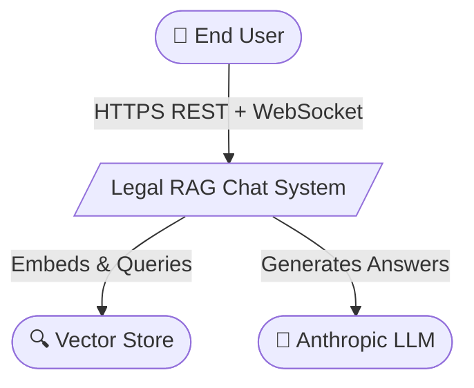

# KFZ-Legal
KFZ Legal — an AI powered legal guidance platform helping immigrants navigate the Australian immigration system.

## Architecture Overview

KFZ-Legal is a **JWT-authenticated, RAG-powered legal chat backend** with asynchronous document ingestion and Socket.io for real-time updates.



For the full set of diagrams (container, component, sequence, ERD), see [`server/Architecture_Diagrams.md`](./server/Architecture_Diagrams.md).

## Tech Stack

| Layer | Technology |
|---|---|
| Runtime | Node.js |
| Framework | Express.js |
| Auth | Passport.js (local + JWT), bcryptjs |
| Database | MongoDB + Mongoose |
| LLM | Anthropic Claude (via Anthropic AI SDK) |
| Embeddings | OpenAI |
| Document Parsing | pdf-parse, mammoth, word-extractor, Multer |
| Real-Time | Socket.io |
| Validation | Zod |
| Logging | Pino + pino-pretty |
| Testing | Mocha, Chai, Sinon, Supertest, Playwright |

## Getting Started

### Prerequisites

- Node.js v20 or higher
- npm v10 or higher
- MongoDB instance

### Installation

1. Clone the repository:
   ```bash
   git clone https://github.com/kryscodeless/KZF-Legal.git
   cd KFZ-Legal
   ```

2. Install dependencies:
   ```bash
   npm install
   ```

3. Copy `.env.example` to `.env` and fill in the required variables:

   | Variable | Required | Description |
   |---|---|---|
   | `NODE_ENV` | Yes | `development` \| `production` \| `test` |
   | `MONGODB_URI` | Yes | MongoDB connection string (app data) |
   | `RAG_MONGODB_URI` | Yes | MongoDB connection string (vector store) |
   | `JWT_SECRET` | Yes | Secret for signing JWTs |
   | `ALLOWED_ORIGINS` | Yes | Comma-separated allowed CORS origins |
   | `ANTHROPIC_API_KEY` | Yes | Anthropic LLM key |
   | `OPENAI_API_KEY` | Yes | OpenAI embeddings key |
   | `EMBED_MODEL` | Yes | OpenAI embedding model name |
   | `LLM_MODEL` | Yes | Anthropic model name |
   | `PORT` | No | Server port (default: `3000`) |
   | `JWT_EXPIRES_IN` | No | Token expiry (default: `7d`) |

4. Start the development server:
   ```bash
   npm run dev
   ```

5. Open the app at **http://localhost:3000/** and verify the API:
   ```bash
   curl http://localhost:3000/api/health
   ```

## Folder Structure

```text
public/               frontend (HTML, CSS, JS)
server/               backend (Express app, routes, services, models)
rag/                  RAG pipeline (in-process module, no separate server)
tests/
  e2e/                Playwright end-to-end tests
  rag/                RAG unit + integration tests
  server/             Server unit + integration tests
```

<details>
<summary>Expand full tree</summary>

```text
public/
  index.html
  css/
    styles.css
  js/
    app.js
    chat.js
    citations.js
    upload.js
    socket.js

server/
  app.js
  server.js
  config/
    env.js
    database.js
    passport.js
  models/
    User.js
    Chat.js
    Message.js
    Document.js
  controllers/
    authController.js
    chatController.js
    documentController.js
  services/
    authService.js
    chatService.js
    documentService.js
  routes/
    index.js
    adminRoutes.js
    authRoutes.js
    chatRoutes.js
    documentRoutes.js
    healthRoutes.js
  middleware/
    authenticateSocket.js
    validateRequest.js
    errorHandler.js
    notFound.js
    requireAuth.js
    requireAdmin.js
    upload.js
  validators/
    authValidator.js
    chatValidator.js
    docValidator.js
  utils/
    logger.js
    seed.js

rag/
  index.js
  chunker.js
  embedder.js
  generator.js
  contextBuilder.js
  documentExtractor.js
  webRetriever.js
  pipeline.js
  schemas/
  storage/
  scripts/
  corpus/

tests/
  e2e/
  rag/
  server/
```

</details>

## Sub-module Documentation

| Module | Doc |
|---|---|
| Backend — API endpoints and request/response shapes | [`server/API_Documentation.md`](./server/API_Documentation.md) |
| Backend — architecture diagrams, data model, ERD | [`server/Architecture_Diagrams.md`](./server/Architecture_Diagrams.md) |
| RAG — pipeline diagrams, module layout, public API | [`rag/README.md`](./rag/README.md) |
| RAG — full BE/FE/RAG integration contract | [`rag/INTEGRATION.md`](./rag/INTEGRATION.md) |
| Frontend — component structure and conventions | [`public/FrontEnd_Documentation.md`](./public/FrontEnd_Documentation.md) |

## Available Scripts

| Script | Description |
|---|---|
| `npm start` | Start the production server |
| `npm run dev` | Start the dev server with hot-reload |
| `npm run seed` | Seed the database with sample data |
| `npm run seed:clear` | Clear all seeded data |
| `npm run test:server` | Run server-side unit + integration tests |
| `npm run test:rag` | Run RAG pipeline tests |
| `npm run test:e2e` | Run Playwright end-to-end tests (requires dev server running) |
| `npm run rag:ingest` | Seed corpus PDFs into the vector store |
| `npm run rag:query` | Run an ad-hoc RAG query from the CLI |
