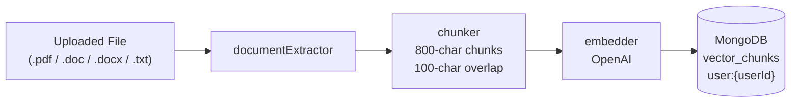
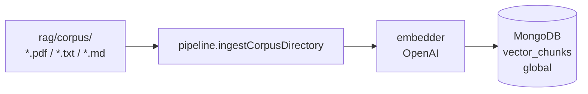
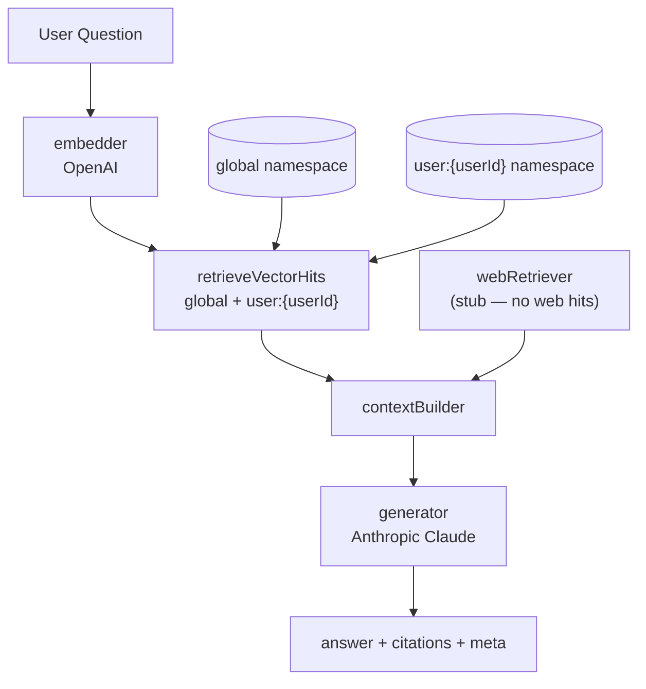

# RAG Pipeline

Retrieval-augmented generation service for KZF-Legal. A pure in-process Node.js module — no separate server, no socket setup. The backend imports and calls it directly.

## Pipeline Architecture

### Document Ingest



### Corpus Seeding (shared knowledge base)



### Query



When `documentIds` are supplied to `submitQuery`, vector retrieval is narrowed to those specific documents in the user namespace while still including global hits.

---

## Module Layout

```
rag/
  index.js              public facade — init, ingestDocument, submitQuery, removeDocument
  chunker.js            separator-aware chunking with overlap
  embedder.js           OpenAI embeddings, batched with retry
  generator.js          Anthropic Claude answer generation
  contextBuilder.js     vectorHits + webResults → contextText + citations
  documentExtractor.js  pdf / doc / docx / txt → plain text
  webRetriever.js       stub (Tavily deferred)
  pipeline.js           ingestText, ingestCorpusDirectory
  schemas/
    api.js              Zod contracts for all public inputs/outputs
    events.js           re-exports CitationSchema only
  storage/
    index.js            createDefaultVectorStore (Mongo)
    mongoVectorStore.js vector_chunks collection on RAG_MONGODB_URI
    vectorSearch.js     shared cosine scoring + document filter
    fileVectorStore.js  in-memory JSON store (unit tests only)
  scripts/
    ingest.js           npm run rag:ingest
    query.js            npm run rag:query
  corpus/               offline seed PDFs for global namespace
```

Tests live under `tests/rag/`, not inside this folder.

---

## Storage

Production uses a dedicated MongoDB URI (`RAG_MONGODB_URI`), separate from the app database.

| Field | Description |
|---|---|
| Collection | `vector_chunks` |
| Namespaces | `global` — shared corpus; `user:{userId}` — per-user uploads |
| Record fields | `id`, `namespace`, `chunk`, `vector`, `metadata` |
| Similarity | In-process cosine scoring (not Atlas Vector Search) |

Indexes: `{ id, namespace }` (unique composite), `{ namespace }`.

---

## Public API

Exported from `index.js`:

| Function | Purpose |
|---|---|
| `init()` | Returns `{ ready: true }`. No side effects. |
| `ingestDocument({ userId, documentId, filePath, mimeType? })` | Extract → chunk → embed → index under `user:{userId}`. |
| `submitQuery({ userId, question, documentIds? })` | Embed question, retrieve context, generate answer. |
| `removeDocument({ userId, documentId })` | Delete indexed chunks for one document. |

All inputs/outputs are validated by Zod schemas in `schemas/api.js`.

Error shape thrown by RAG:
```json
{ "code": "RAG_VALIDATION_ERROR | RAG_UPSTREAM_ERROR | RAG_TIMEOUT | RAG_INTERNAL", "message": "...", "retryable": true }
```

---

## CLI Quick Start

```bash
# 1. Configure .env (copy from .env.example)
#    Required: OPENAI_API_KEY, ANTHROPIC_API_KEY, RAG_MONGODB_URI

# 2. Seed the shared corpus into the vector DB
npm run rag:ingest

# 3. Ask a question
npm run rag:query -- "What visa options are available?"
```

Expected output: `Answer:` block, `Citations:` list, `Meta:` with latency and retrieval counts.

Note: `rag:ingest` can take a few minutes on first run due to embedding volume over `rag/corpus/`.

---

## Further Reading

- [`INTEGRATION.md`](./INTEGRATION.md) — full BE/FE/RAG contract (socket events, request/response shapes, error codes)
